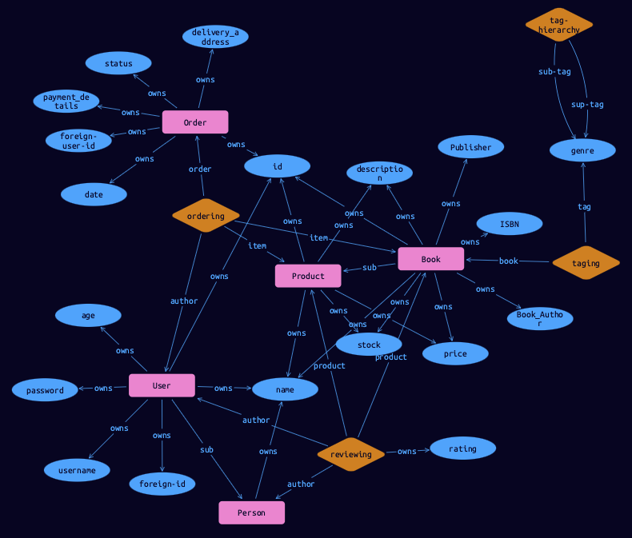

# Bookstore example

[](http://forthebadge.com) [](https://forthebadge.com)

This is a simple example of using TypeDB.

## Introduction

We have an imaginary online bookstore and our script/application implements some very basic functions:

- Search for a book
- Search for a user
- Search for an order
- Search for books by genre

This application consists of Python scripts. It has not much in terms of usability as it is merely a 
demonstration of TypeDB queries. But you can easily explore the implementation of each function in the scripts.

## Prerequisites

* [TypeDB](https://docs.vaticle.com/docs/running-typedb/install-and-run) v2.14.1+
* Python v.3.9+
  * `typedb.client` — [Python client](https://docs.vaticle.com/docs/client-api/python) for TypeDB
  * Common Python libraries: os, csv, argparse, enum, uuid, random, unittest
* This repository

## Quickstart

1. Checkout this repository: `git clone https://github.com/vaticle/typedb-examples && cd typedb-examples`
2. Start the [TypeDB Server](http://docs.vaticle.com/docs/running-typedb/install-and-run#start-the-typedb-server). Check that it's listening to address: `0.0.0.0:1729`.
3. Launch `typedb-examples/commerce/bookstore/python/load_data.py` Python script. It will load the bookstore schema and data into the DB.
4. Launch `typedb-examples/commerce/bookstore/python/requests.py` Python script and follow the instructions to explore example functions and data.
5. Use this simple example to learn the basics of using TypeDB! Explore source codes of the Python scripts and use TypeDB Studio to explore DB schema and content.

## How it works

### Files

This example is located in the `typedb-examples/commerce/bookstore/` directory and consists of the following main files:
- Python scripts
  - `python/load_data.py` — used to load the bookstore DB schema and data
  - `python/requests.py` — provides simple command line interface to execute requests on TypeDB database
  - `python/loaders.py` — internal (imported) file with data loading classes and functions
  - `python/config.py` — internal settings: database name and path to directory with imported csv files
- `schema.tql` — DB schema in TypeQL
- `README.md` — documentation for the bookstore example. You are reading it right now
- `tests.py` — a set of tests for the example
- `todo.md` — list of ideas for improvements in the future. If you want to contribute to this example, you can start with these ideas
- Bookstore dataset `data/`:
  - `books.csv`
  - `users.csv`
  - `ratings.csv`
  - `order.csv`
  - `genres.csv`
- `request-examples/` — directory with examples of requests for the database. Files of `.tql` format can be used in Type DB Studio directly or to create a request for other TypeDB clients
- `requirements.txt` — list of major requirements for internal testing environment

### Schema

The schema stored in the `schema.tql` file and loaded by the `load_data.py` script.



#### Attributes

The bookstore schema has the following attributes:

- name (string)
- description (string)
- id (string) 
- ISBN (string) 
- book-author (string) 
- publisher (string) 
- foreign-user-id (string) 
- status (string) 
- delivery-address (string) 
- payment-details (string) 
- username (string) 
- password (string) 
- foreign-id (string) 
- genre-tag (string) 

- created-date (datetime)

- price (long) 
- stock (long) 
- rating (long) 
- age (long)

#### Entities

The bookstore schema has the following entities:

- product 
  - book
- person
  - user

#### Relations

The bookstore schema has the following relations:

- review
- order
- tag-hierarchy

#### Rules

The bookstore schema has two rules to demonstrate rules usability.

The first one works for genre tags, serves no real purpose but follows the following basic logic — a child (sub-tag) of my child is my child. The code for the first rule:

```
rule super-tag-hierarchy:
    when {
        (sup-tag: $p, sub-tag: $b) isa tag-hierarchy;
        (sup-tag: $b, sub-tag: $bb) isa tag-hierarchy;
    } then {
        (sup-tag: $p, sub-tag: $bb) isa tag-hierarchy;
    };
```

The second one works also for genre tags, used to improve tag searching experience. By assigning tag to a book you 
are also assigning all sup-tags to the same book. So the book can be found not only by exact tag you have assigned 
to it, but also by all the parent tags of this tag.

```
rule super-tag-ownership:
    when {
        $book isa book;
        $g isa genre-tag;
        $book has $g;
        $sup isa genre-tag;
        (sup-tag: $sup, sub-tag: $g) isa tag-hierarchy;
    } then {
        $book has $sup;
    };
```
