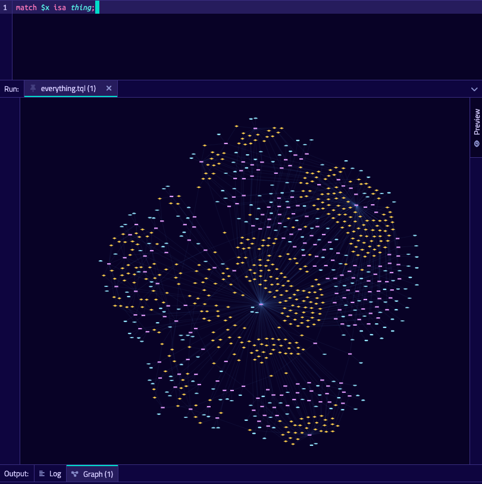

# GitHub TypeDB Example



## What is this?
GitHub is the site you're on right now! It has an [API](https://docs.github.com/en/rest) which you can use to get data
about almost anything GitHub. 

This is a rich source of interconnected data that we can store in TypeDB and query
elegantly with TypeQL.

## How to get started.
1. Download your OS-appropriate version of [TypeDB](https://github.com/vaticle/typedb/releases).
2. Run the server with `./typedb server`
3. Clone this repository and enter it with `git clone https://github.com/vaticle/typedb-examples && cd typedb-examples`
4. Install [Bazel](https://docs.bazel.build/versions/master/install.html)
5. Run `bazel build //...`.
6. Run the compose-jb application with `bazel build //github:github-bin-<YOUR_OS_NAME>`

Now you can use the application to explore any GitHub repository. If you don't want to set up GitHub access tokens, 
explore an example repository by entering `vaticle/typedb` into the prompt.

You can also use [TypeDB Studio](https://github.com/vaticle/typedb-studio/releases) to explore the data. Connect to
`localhost:1729` and open the `github` database in TypeDB studio. See the example queries below for ideas.

## Model
For this short example, we create and import a stripped down version of a repository. An example of the data model is 
as follows:
```json
{{
  "repo": {
    "id": 63110867,
    "name": "typedb",
    "description": "TypeDB: a strongly-typed database",
    "author": "vaticle"
  },
  "users": [
    {
      "name": "vaticle"
    },
    {
      "name": "jmsfltchr"
    },
    {
      "name": "flyingsilverfin"
    }
  ],
  "commits": [
    {
      "author": "jmsfltchr",
      "hash": "d51dca7bb0dd2839ea804eb0531bbf18834c3f90",
      "date": "Mon Jun 13 16:13:16 BST 2022",
      "files": [
        "reasoner/controller/ConcludableController.java",
        "reasoner/controller/ConclusionController.java",
        "reasoner/controller/ConditionController.java",
        "reasoner/controller/DisjunctionController.java",
        "...",
      ]
    },
    {
      "author": "jmsfltchr",
      "hash": "91013b15c94b6804361ad9c7b6fe5f16977d7b48",
      "date": "Mon Jun 13 09:20:31 BST 2022",
      "files": [
        "..."
      ]
    },
    {"..."}
  ],
  "files": [
    "common/iterator/sorted/SortedIterators.java",
    "common/exception/ErrorMessage.java",
    "traversal/procedure/ProcedureVertex.java",
    "traversal/procedure/CombinationProcedure.java",
    "reasoner/processor/AbstractRequest.java",
    "reasoner/processor/AbstractProcessor.java",
    "..."
  ]
}
```

## Queries

All of these queries are available through [github.state.Explorer](github/state/Explorer.kt) and the compose-jb
application.

### Which users collaborated on a given file?
```tql
match $file isa file, has file_name "FILE_NAME_HERE";
$commit_file(file: $file, commit: $commit) isa commit_file;
$commit_author(commit: $commit, author: $author) isa commit_author;
$author has user_name $x;
get $x;
```
### Which files had a given user edit them across all commits?
```tql
match $user isa user, has user_name "USER_NAME_HERE";
$commit_author(commit: $commit, author: $user) isa commit_author;
$commit_file(file: $file, commit: $commit) isa commit_file;
$file has file_name $x;
get $x;
```
### Who worked on a given repo?
```tql
match $repo isa repo, has repo_name "REPO_NAME_HERE";
$commit_repo(commit: $commit, repo: $repo) isa commit_repo;
$commit_author(commit: $commit, author: $author) isa commit_author;
$author has user_name $x;
get $x;
```
### Which repos did a given user work on?
```tql
match $user isa user, has user_name "USER_NAME_HERE";
$commit_author(commit: $commit, author: $user) isa commit_author;
$commit_repo(repo: $repo, commit: $commit) isa commit_repo;
$repo has repo_name $x;
get $x;
```
### Given a commit hash, which users have also touched those files?
```tql
match $commit isa commit, has commit_hash "COMMIT_HASH_HERE";
$commit_file(commit: $commit, file: $file) isa commit_file;
$commit_file2(commit: $commit2, file: $file) isa commit_file;
$commit_author(commit: $commit2, author: $author) isa commit_author;
$author has user_name $x;
get $x;
```
### Given a file, how many times has that file been edited?
```tql
match $file isa file, has file_name "FILE_NAME_HERE";
$commit_file(commit: $commit, file: $file) isa commit_file;
$commit_file2(commit: $commit2, file: $file) isa commit_file;
not {$commit_file is $commit_file2;};
get $commit_file; count;
```