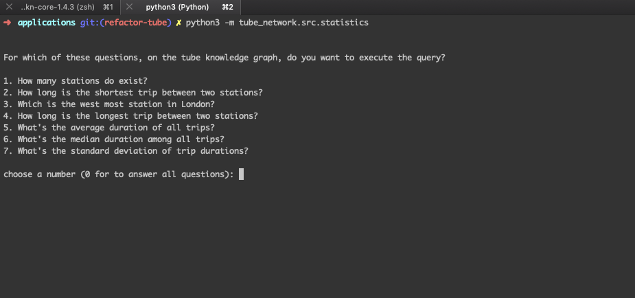
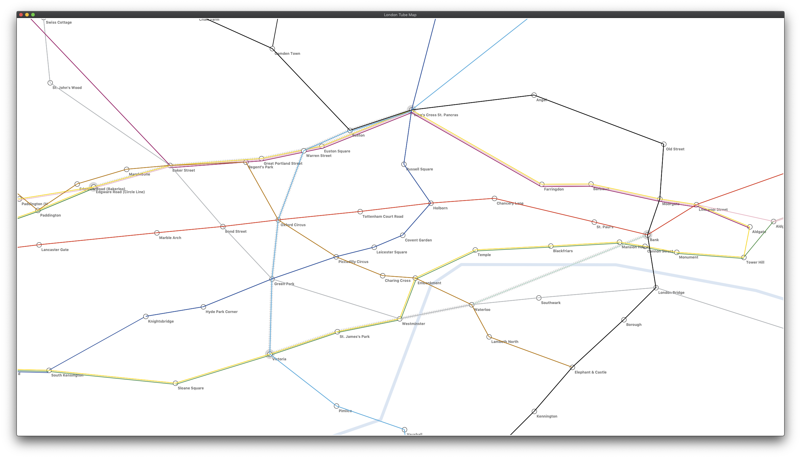
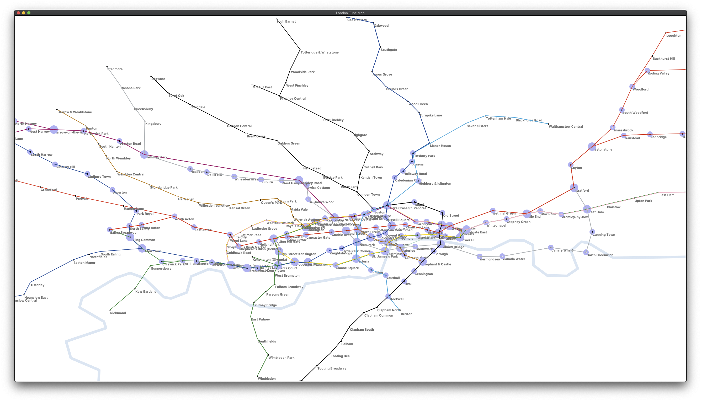
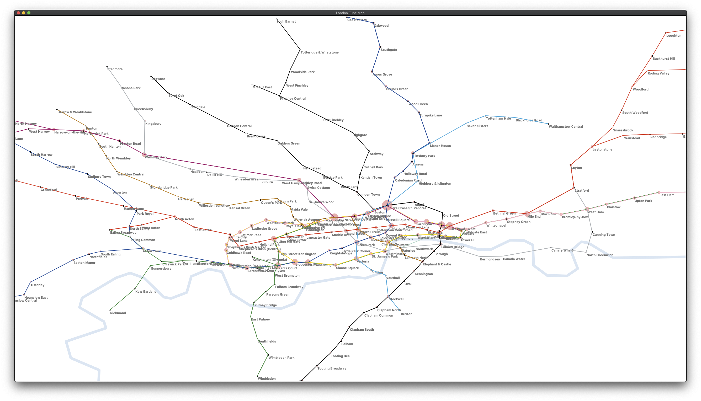
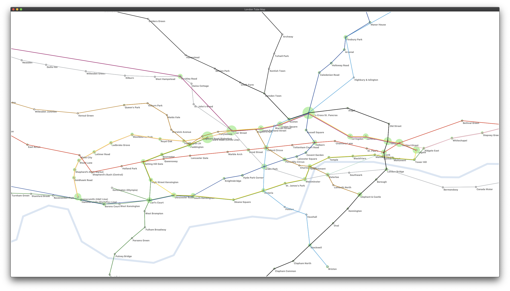

# Tube Network Example

Here we demonstrate a way of modelling the London Underground Network using data acquired from the Transport for London (TFL) website.

Most of the code given here is written in Python to give an example of how to use the Grakn Python client.

See the _Quickstart_ for how to get going immediately, or read on for more info.

## Prerequisites

- Grakn that is compatible with the latest version of [Clinet Python](http://dev.grakn.ai/docs/client-api/python#dependencies)
- Python >= 3.6

## Quickstart
- Clone this repository: `git clone git@github.com:graknlabs/examples.git`
- Navigate to the Grakn distribution directory: `cd path-to-grakn-dist-directory` (this step isn't required if Grakn is installed using a package manager such as `brew`)
- Start the Grakn Server: `./grakn server start`
- Create the keyspace and load the schema: `./grakn console -k tube_network -f path-to-the-cloned-examples-dir/schemas/tube-network-schema.gql`
- Install the `grakn` module: `pip install grakn-client`. Learn more about [Client Python](http://dev.grakn.ai/docs/client-api/python).
- Migrate the dataset: `python3 -m tube_network.src.migration`. Learn more about [migrating data to Grakn by example](http://dev.grakn.ai/docs/examples/phone-calls-migration-python).
- To continue:
    - Run queries on the London Tube Network using [Graql Console](http://dev.grakn.ai/docs/running-grakn/console) and [Workbase](http://dev.grakn.ai/docs/workbase/overview).
    - or:
        - Perform statistical queries: `python3 -m tube_network.src.statistics`. Learn more about the [Compute Queries](http://dev.grakn.ai/docs/query/compute-query).
        - Try the journey planner: `python3 -m tube_network.src.journey_planner`
        - Interact with the journey planner interface: `python3 -m tube_network.src.app`

## Download Data

The data necessary to build a Grakn of the Tube Network is already included in this repository, the code to acquire it can be found in [`src/download_data.py`](src/download_data.py).

## Import Data

We can import this data into the Grakn keyspace we have just created. The name of the keyspace is set in `settings.py`, so you can change it there if you need to. You don't have to implement settings in this way in your own application.
Check Grakn is up and running: `./grakn server status`
To import, run the [`src/migration.py`](src/migration.py), either in your IDE, or from the grakn_examples directory as follows:

```bash
python3 -m tube_network.src.migration
```

The content of [`src/migration.py`](src/migration.py) is a python script that:
1. as it goes through the TFL's `.json` files, constructs dictionaries with a pre-defined structure that get passed on to the template functions for constructing Graql relation/entity insert queries.
2. the constructed Graql insert queries, after basic uniqueness validation, get stored as items of arrays within a dictionary.
3. the dictionary containing all the Graql queries is flattened to prepare the data in two chunks, one chunk of entities and one chunk of relations, for a series of concurrent insertions.
4. lastly, a set of processes initiate the set of transactions that perform the Graql insert queries on the `tube_network` keyspace.

Once complete, you have stored the tube network data in Grakn!
Now you're ready to start playing with the data.


## Gain Insights

Now you can query the database, you can try asking more complex questions, like asking for the time between stations of over 8 minutes:
```
match
    $sta1 isa station, has name $sta1-nam;
    $sta2 isa station, has name $sta2-nam;
    (beginning: $sta1, end: $sta2, service: $sec) isa tunnel;
    $sec isa route-section, has duration $dur; $dur > 8.0;
    (route-operator: $tul, section: $sec) isa route;
    $tul isa tube-line, has name $tul-nam;
get $sta1-nam, $sta2-nam, $tul-nam, $dur; limit 30;
```

## Retrieve Statistical Information

To gain an overall understanding of the available statistical queries in Grakn, try the [`src/statistics.py`](src/statistics.py).
As soon as you run `python3 -m tube_network.src.statistics`, the terminal enters the interactive mode, where you'll be able to select a question of your choice and observe how the answer is obtained.



## Try the Journey Planner

To try the out-of-the-box `compute path` query of Grakn, you can run the [`src/journey_planner.py`](src/journey_planner.py).

```bash
python3 -m tube_network.src.journey_planner
```

Enter the departing and destination stations, as well as the shortest path strategy and in return obtain the shortest path of stations that connect the two given stations.

## Visualise and interact with the Tube Network

[app.py](src/app.py) is a demo application to show the analytics capabilities built into Grakn.

```bash
python3 -m tube_network.src.app
```
Opening the demo app for the first time may take up to a minute.

### The Basics

- Drag mouse to pan
- Press `=`/`+` to zoom in
- Press `-`/`_` to zoom out
- Press `c` to clear the map of analytics

### Find Shortest Path

Hold `shift` and click on a station or the station's name (station _A_). Do the same on another station (station _B_). This will show the shortest path via stations and tunnels to connect _A_ and _B_.
Hold `shift` and click on a further station _C_ to add the path(s) from _B_ to _C_.
So, you should be able to find the shortest path from some station _A_ to some station _E_, via stations _B_, _C_ and _D_.
Use `q` to clear the shortest path(s), or `c` to remove anything that has been drawn on top of the map.



### Compute Centrality

Keymap:

#### Press `d` to `compute centrality of station, in [station, tunnel], using degree;`



#### Press `k` to `compute centrality of station, in [station, tunnel], using k-core;`



#### Press `r` to `compute centrality of the station, in [station, route], using degree;`



#### From any state, press `c` to clear the map of analytics.